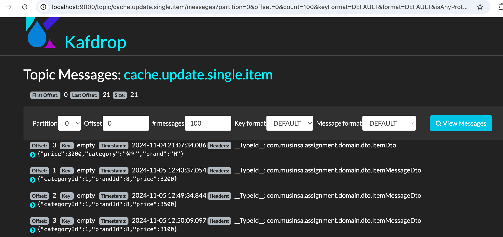
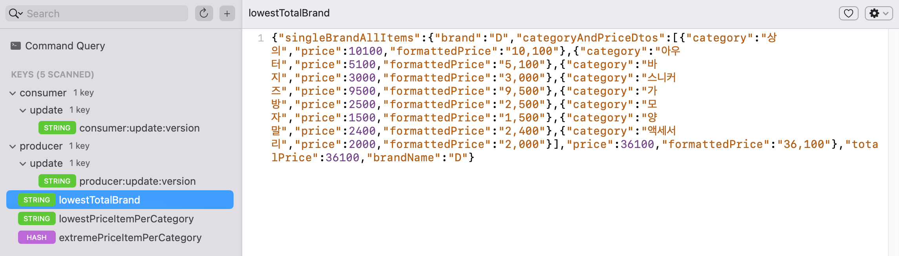
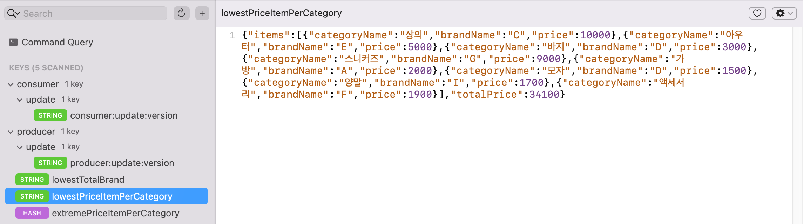
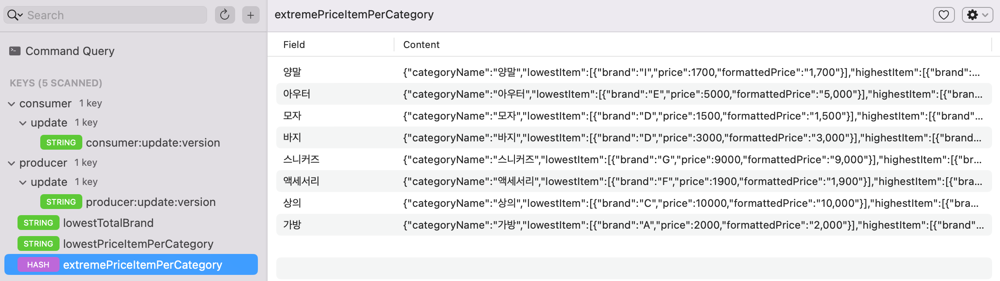

## 실행방법
docker, docker-compose 설치된 환경에서\
`docker-compose up --build`

## 구현한 부분
구현1,2,3
구현4 - 상품 단건 수정
구현에 대한 상세 설명 - PR

### 엔티티 객체 관계

고려한 사항: 요구사항을 보니 Category가 나열 순서가 있는 것으로 보여,\
사내에서 카테고리에 대한 나열 순서를 관리하면 좋을 것 같아 마스터 테이블에 sort order 추가.\
따로 추가한 제약 사항: 각 브랜드는 모든 카테고리에 대해 하나의 상품만 꼭 가져야 함.\
(상품 테이블 - 브랜드&카테고리 유니크 인덱스 추가. [schema.sql](admin/src/main/resources/schema.sql) 참고)

## 구조
### 1차 (feature/simple 브랜치)

### 2차 (feature/advance, main 브랜치)

트래픽 증가할 경우 예상하여 메시지 기반 EDA로 구성.\
레디스 캐싱 추가.

## 기타 개발에 고려한 사항
### 캐싱 필요 여부 판단하여 부분 업데이트
#### 전체 (브랜드+모든 카테고리 전부) 캐싱

브랜드 단위 수정이 빈번할 경우 DB 부하를 줄 수 있는 전체 조회가 계속 이루어지는데
특히 중복되어 이루어지는 경우를 막고자 함

프로듀서에서는 DB 업데이트 하고 레디스 컨슈머 버전 incr하고
그 값을 카프카에 메시지로 넣음. 

카프카에 프로듀서 버전으로 1 ~ 9가 쌓인 경우\
컨슈머는 1을 처리할 때 레디스에 있는 컨슈머 버전을 읽어서 (없으면 0으로 간주)\
메시지 버전 vs. 컨슈머 버전 비교해서\
컨슈머 버전이 더 작은 경우\
레디스 컨슈머 버전 <- 레디스 프로듀서 버전(여기서는 9)로 업데이트 후 캐시 전체 업데이트 진행.\
그럼 이후 2 ~ 9까지는 컨슈머가 skip하게 됨.

#### 상품 단건 수정된 경우
- 상품 단건 수정 시, 해당 상품이 속한 카테고리에 대한 캐시만 업데이트
- 최저가, 최고가 업데이트 필요한지 여부 판단하여 처리

### 테스트
1차에 fake 사용하여

## 실행 방법

## 카프카, Redis 실행 화면

